# 📄 Design Doc: Replace Snipcart with Stripe Checkout + custom cart

**Status:** Draft · **Author:** Kevin · **Scope:** Photography print store

Goal: drop Snipcart (and its per-order fees / hosted cart) and replace it with a
minimal, self-owned cart + Stripe Checkout. Keep it as simple as possible;
inventory and order fulfillment stay manual via the Stripe Dashboard.

---

## 0) Grounding: what already exists in this repo

This is written against the actual codebase, not a greenfield template. The
migration is smaller than the generic draft suggests because a lot of
infrastructure is already here.

| Concern          | Already exists                                                                                | File                            |
| ---------------- | --------------------------------------------------------------------------------------------- | ------------------------------- |
| Deploy target    | **Vercel** (server runtime — API routes & webhooks work)                                      | `README.md`, Vercel project     |
| Router           | App Router, Next 14.2.3, pnpm 8.6.7                                                           | `src/app/`                      |
| Price catalog    | 6 size/material variants, server-side, `$` values                                             | `src/constants/photoPricing.ts` |
| Product assembly | `getSnipcartProduct(photoID, variant)` → id/name/price/image/desc                             | `src/utils/snipcart.ts`         |
| Email sending    | `EmailServiceFactory.create().sendEmail({to,from,subject,content})`                           | `src/services/email/*`          |
| Email deps       | `mailgun.js`, `form-data`, `@sendgrid/mail` installed                                         | `package.json`                  |
| Analytics        | PostHog `add_to_cart` event on the button                                                     | `ProductDetails.tsx:98`         |
| `.env` policy    | `.env` committed with **empty** values (de-facto example); `.gitignore` ignores `.env*.local` | `.env`, `.gitignore`            |

**What does NOT exist yet:** the `stripe` package, any cart state, a checkout
API route, a webhook, and success/cancel pages.

### Snipcart touch points to remove

- `src/components/organisms/Snipcart/Snipcart.tsx` — loads Snipcart JS/CSS.
- `<Snipcart />` mounted globally in `src/app/layout.tsx:98`.
- `src/components/organisms/Snipcart/CartButton.tsx` + `<CartButton />` in `src/app/photography/layout.tsx:17`.
- `data-item-*` attributes + `snipcart-add-item` class in `ProductDetails.tsx:89-107`.
- `src/app/api/product/[photo_id]/pricing.json/route.ts` — Snipcart order-validation crawler (no longer needed; server validates directly).
- `getSnipcartProduct` / `ISnipcartProduct` in `src/utils/snipcart.ts` — rename/repurpose (see §4).
- `NEXT_PUBLIC_SNIPCART_KEY` in `.env`, `src/utils/getSnipcartPublicKey.ts`.

---

## 1) Architecture

```mermaid
flowchart LR
  A[ProductDetails: Add to cart] --> B[Cart cookie]
  B --> C[/photography/cart page/]
  C --> D[POST /api/checkout]
  D --> E[Server re-derives prices from photoPricing]
  E --> F[Stripe Checkout Session]
  F --> G[Redirect to Stripe hosted page]
  G --> H[Payment complete]
  H --> I[Stripe webhook: checkout.session.completed]
  I --> J[Verify signature]
  J --> K[EmailServiceFactory → order email to Kevin]
  K --> L[Manual fulfillment via Stripe Dashboard]
```



Key principle: **the client never sends prices.** The cart cookie stores only
`{ photoID, variantId, qty }`. The server looks up the real price in
`photoPricing` at checkout time. This makes cart tampering a non-issue and keeps
"inventory" in one place.

### What "manual inventory management" means here

Prints are per-photo × 6 variants — far too many combinations to pre-create as
Stripe Products. So:

- **Variants/prices** live in `photoPricing.ts` (edit code to change a size/price, or flip `inStock`).
- **Per-photo availability** uses the existing `PhotoTags.NotForSale` tag.
- **Orders & fulfillment** are managed entirely in the **Stripe Dashboard** (view paid sessions, customer + shipping details, mark as fulfilled). Line items carry the photo name + variant so each order is self-describing.

Checkout uses inline `price_data` (not pre-created Stripe Prices) precisely so
you never have to sync a product catalog into Stripe.

---

## 2) Dependencies

```bash
pnpm add stripe
```

That's it. Email libs are already installed; no `axios`/`form-data` additions
needed — reuse `EmailServiceFactory`.

Also add `@stripe/stripe-js` **only if** you want client-side redirect via
`stripe.redirectToCheckout`. Not required — the server returns `session.url` and
we can `window.location = url` directly. Recommend skipping it.

---

## 3) Environment variables

Follow the repo's existing convention: keep committing `.env` with **empty**
values (it already serves as the checked-in example), and put real values in
Vercel + a local `.env.local` (which is gitignored via `.env*.local`).

Add to `.env` (empty, committed):

```bash
# Stripe
STRIPE_SECRET_KEY=
NEXT_PUBLIC_STRIPE_PUBLISHABLE_KEY=   # only needed if using @stripe/stripe-js
STRIPE_WEBHOOK_SECRET=

# Order notifications (MAILGUN_* / SENDGRID_* already present)
ORDER_NOTIFICATION_EMAIL=
```

Real values go in:

- **Vercel** project env (Production + Preview).
- **`.env.local`** for local dev (gitignored).

Server-only (never `NEXT_PUBLIC_`): `STRIPE_SECRET_KEY`, `STRIPE_WEBHOOK_SECRET`,
`MAILGUN_API_KEY`, `SENDGRID_API_KEY`.

> ⚠️ Cleanup task: remove `NEXT_PUBLIC_SNIPCART_KEY` from `.env` and delete
> `getSnipcartPublicKey.ts` when Snipcart is torn out.

---

## 4) Data model & product assembly (reuse, lightly renamed)

`photoPricing.ts` stays exactly as-is (the source of truth). Repurpose
`getSnipcartProduct` → a provider-neutral `getPrintProduct` returning the same
shape minus the Snipcart-specific `url`:

```ts
// src/utils/printProduct.ts  (was snipcart.ts)
export interface PrintProduct {
  id: string; // `${photoID}_${variant.id}`
  name: string; // `${photoName} (${variant.name})`
  description: string;
  image: string; // absolute CDN URL for Stripe line item image
  price: number; // dollars, from photoPricing
}
```

Cart cookie item shape (all the client needs to store):

```ts
type CartItem = { photoID: string; variantId: string; qty: number };
```

---

## 5) Cart (cookie-backed, client-side)

Keep it minimal. A tiny client cart context + a cookie. No global state library.

- **Storage:** one cookie, e.g. `cart`, JSON of `CartItem[]`. Use a small helper
  (`document.cookie` or the `cookies-next`-style pattern already used elsewhere,
  or just `js-cookie` if you prefer — check what's installed first).
- **Add to cart:** in `ProductDetails.tsx`, replace the Snipcart `data-item-*`
  button with an `onClick` that upserts `{ photoID, variantId: selectedSize.id, qty }`
  into the cookie. **Keep the existing `posthog.capture("add_to_cart", …)` call.**
- **Cart button:** replace `CartButton.tsx` with a floating button that shows the
  item count (read from cookie) and links to `/photography/cart`.
- **Cart page:** new route `src/app/photography/cart/page.tsx`. Reads the cookie,
  renders line items (photo name via `getPhotoName`, price via `photoPricing`
  lookup, thumbnail via CDN), supports qty change / remove, shows subtotal, and a
  "Checkout" button that POSTs to `/api/checkout`.

Add to `PAGES.PHOTOGRAPHY` in `src/utils/pages.ts`:

```ts
CART: "/photography/cart",
CHECKOUT_SUCCESS: "/photography/cart/success",
```

> Note: cookie has a ~4KB limit. Storing only ids/qty (not full product data)
> keeps carts tiny even with many items. If it ever matters, fall back to
> `localStorage`; cookies are fine to start.

---

## 6) Checkout API — `src/app/api/checkout/route.ts`

```ts
import Stripe from "stripe";
import { NextRequest } from "next/server";
import { photoPricing } from "@/constants/photoPricing";
import { getPrintProduct } from "@/utils/printProduct";
import { PAGES } from "@/utils/pages";
import { siteMetadata } from "@/constants/siteMetadata";

const stripe = new Stripe(process.env.STRIPE_SECRET_KEY!);

export async function POST(req: NextRequest) {
  const {
    items,
  }: { items: { photoID: string; variantId: string; qty: number }[] } =
    await req.json();

  const line_items = items.map((item) => {
    const variant = photoPricing.find((v) => v.id === item.variantId);
    if (!variant || !variant.inStock) {
      throw new Error(`Unavailable variant: ${item.variantId}`);
    }
    const product = getPrintProduct(item.photoID, variant); // server-side price

    return {
      quantity: Math.max(1, Math.min(item.qty, 20)), // clamp
      price_data: {
        currency: "usd",
        unit_amount: Math.round(variant.price * 100), // dollars → cents
        product_data: {
          name: product.name,
          description: product.description,
          images: [product.image],
          metadata: { photoID: item.photoID, variantId: item.variantId },
        },
      },
    };
  });

  const base = siteMetadata.siteUrl;
  const session = await stripe.checkout.sessions.create({
    mode: "payment",
    line_items,
    success_url: `${base}${PAGES.PHOTOGRAPHY.CHECKOUT_SUCCESS}?session_id={CHECKOUT_SESSION_ID}`,
    cancel_url: `${base}${PAGES.PHOTOGRAPHY.CART}`,
    allow_promotion_codes: true,
    shipping_address_collection: { allowed_countries: ["US"] }, // physical prints
    // Optional: add flat-rate shipping via `shipping_options` (create rate in Stripe dashboard)
  });

  return Response.json({ url: session.url });
}
```

Client "Checkout" handler: `POST` the cookie's items, then
`window.location.href = data.url`.

**Shipping (decided):** collect a US shipping address
(`shipping_address_collection`). Shipping cost is controlled from the **Stripe
Dashboard**: create a shipping rate there and set its ID in the optional
`STRIPE_SHIPPING_RATE_ID` env var — the checkout route passes it as
`shipping_options` when present. Leave it unset for no shipping charge. Rates
can be added/changed later without code changes.

---

## 7) Webhook — `src/app/api/stripe/webhook/route.ts`

Reuse the existing email service; do **not** hand-roll Mailgun.

```ts
import Stripe from "stripe";
import { NextRequest } from "next/server";
import { EmailServiceFactory } from "@/services/email/EmailServiceFactory";

const stripe = new Stripe(process.env.STRIPE_SECRET_KEY!);

export async function POST(req: NextRequest) {
  const body = await req.text(); // raw body required for signature check
  const sig = req.headers.get("stripe-signature")!;

  let event: Stripe.Event;
  try {
    event = stripe.webhooks.constructEvent(
      body,
      sig,
      process.env.STRIPE_WEBHOOK_SECRET!,
    );
  } catch (err) {
    return new Response(`Webhook signature verification failed`, {
      status: 400,
    });
  }

  if (event.type === "checkout.session.completed") {
    const session = event.data.object as Stripe.Checkout.Session;

    // Line items aren't on the base session object — fetch them for the email body.
    const lineItems = await stripe.checkout.sessions.listLineItems(session.id, {
      limit: 100,
    });
    const summary = lineItems.data
      .map((li) => `${li.quantity}× ${li.description}`)
      .join("\n");

    const email = EmailServiceFactory.create();
    await email.sendEmail({
      to: { name: "Kevin", email: process.env.ORDER_NOTIFICATION_EMAIL! },
      from: {
        name: "Print Orders",
        email: process.env.ORDER_NOTIFICATION_EMAIL!,
      },
      subject: `📸 New print order — $${(session.amount_total ?? 0) / 100}`,
      content:
        `New order received\n\n` +
        `Customer: ${session.customer_details?.email}\n` +
        `Ship to: ${JSON.stringify(session.shipping_details?.address)}\n` +
        `Total: $${(session.amount_total ?? 0) / 100}\n\n` +
        `Items:\n${summary}\n\n` +
        `Stripe session: ${session.id}`,
    });
  }

  return new Response("ok");
}
```

**App Router note:** App Router route handlers already receive the raw body via
`req.text()`, so there's no `bodyParser` config to disable (that was a Pages
Router concern). Just don't call `req.json()` before verifying.

**Implementation notes (the shipped route goes beyond this sketch):**

- **Don't trust the event payload's shape.** Event payloads follow the webhook
  _endpoint's_ configured API version, not the SDK's — on older versions the
  shipping address lives at `session.shipping_details` instead of
  `session.collected_information.shipping_details`. The route re-retrieves the
  session via the SDK so the shape always matches the SDK's pinned version.
- **Gate on `payment_status === "paid"`.** Delayed-notification payment methods
  (eg. ACH) fire `checkout.session.completed` while the session is still
  `unpaid`; the order email is sent only once paid. The route also handles
  `checkout.session.async_payment_succeeded` (email) and logs
  `checkout.session.async_payment_failed`.
- **Expand `data.price.product` on line items** so the exact `photoID`
  (product metadata) appears in the order email — display names alone can be
  ambiguous for fulfillment.

---

## 8) Testing

- Use Stripe **test** keys (`sk_test_…`) locally.
- Test card `4242 4242 4242 4242`, any future date / CVC / ZIP.
- Stripe CLI to exercise the webhook locally:
  ```bash
  stripe login
  stripe listen --forward-to localhost:3000/api/stripe/webhook   # copy the whsec_… into .env.local
  stripe trigger checkout.session.completed
  ```
- Verify the order email actually sends (Mailgun sandbox or your real domain).

---

## 9) Deployment (Vercel)

- Add all Stripe + email env vars in the Vercel dashboard (Production + Preview).
- Register the production webhook in Stripe:
  `https://<your-domain>/api/stripe/webhook`, events
  `checkout.session.completed`, `checkout.session.async_payment_succeeded`,
  and `checkout.session.async_payment_failed`. Copy that endpoint's signing
  secret into `STRIPE_WEBHOOK_SECRET` on Vercel.
- When creating the endpoint, **pin its API version** to the version the
  installed `stripe` SDK targets (see `node_modules/stripe/cjs/apiVersion.js`,
  currently `2026-06-24.dahlia`) rather than the account default. The route
  re-retrieves sessions so it tolerates a mismatch, but pinning keeps event
  payloads and SDK types consistent.
- No static-export concern — the site already runs a Node runtime on Vercel.

---

## 10) Security checklist

| Risk                         | Mitigation                                                        |
| ---------------------------- | ----------------------------------------------------------------- |
| Leaking API keys             | `.env` committed empty; real values only in Vercel + `.env.local` |
| Client tampers with price    | Server ignores client price; re-derives from `photoPricing`       |
| Fake webhook calls           | `stripe.webhooks.constructEvent` signature verification           |
| Payment fraud                | Handled by Stripe                                                 |
| Selling out-of-stock variant | `inStock` check in checkout route                                 |
| Stale Snipcart key public    | Remove `NEXT_PUBLIC_SNIPCART_KEY` + `getSnipcartPublicKey.ts`     |

---

## 11) Migration checklist (build order)

1. `pnpm add stripe`; add env vars (empty in `.env`, real in `.env.local` + Vercel).
2. Rename `src/utils/snipcart.ts` → `printProduct.ts`; `getSnipcartProduct` → `getPrintProduct` (drop `url`).
3. Add cart cookie helpers + a small cart context; add `CART`/`CHECKOUT_SUCCESS` to `PAGES`.
4. Rewrite the "Add to cart" button in `ProductDetails.tsx` (keep the PostHog event).
5. Replace `CartButton.tsx` with a count badge linking to `/photography/cart`.
6. Build `src/app/photography/cart/page.tsx` (+ success page).
7. Add `POST /api/checkout` (§6).
8. Add `POST /api/stripe/webhook` (§7).
9. Test end-to-end with Stripe CLI + test card.
10. Delete Snipcart: `Snipcart.tsx`, `<Snipcart/>` in root layout, old `pricing.json` route, `getSnipcartPublicKey.ts`, `NEXT_PUBLIC_SNIPCART_KEY`, Snipcart Script/CSS.
11. Ship to Vercel; register production webhook; do one real low-value live test.

---

## 12) Decisions

1. **Shipping** — Dashboard-configurable via optional `STRIPE_SHIPPING_RATE_ID`
   (see §6). US-only address collection to start; shipping charges may be added
   later if need be, with no code changes.
2. **Order storage** — email-only. The Stripe Dashboard is the order history;
   no DB records.
3. **Cart persistence** — cookie only, single device.
